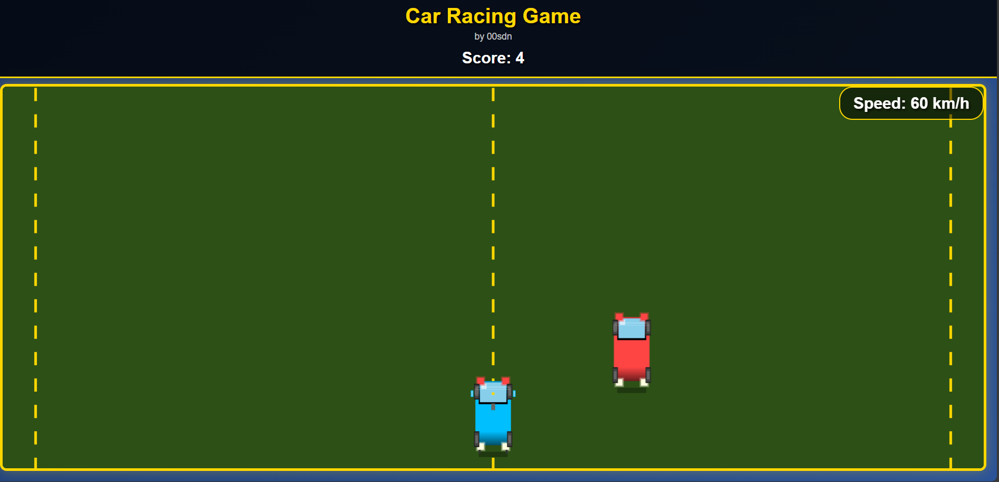

# 🏎️ Mini Car Racing Game

A fast-paced, browser-based **Car Racing Game** built with vanilla HTML, CSS, and JavaScript. Navigate through an endless road, dodge enemy cars, collect power-ups, and boost your score!



## 🎮 Features

- 🚗 Realistic car visuals (headlights, taillights, wheels)
- 🕹️ Smooth left/right movement using arrow keys
- 📈 Speed increases over time (with speedometer)
- 🛡️ Invincibility power-ups with visual/sound effects
- 🧮 Score tracking and **Game Over** screen
- 🔁 Restart option after crash
- 🔊 Built-in sound effects (no external audio files)
- 📱 Fully responsive and mobile-friendly canvas

## 🕹️ Controls

- **← Left Arrow** – Move Left  
- **→ Right Arrow** – Move Right  

## 🌍 Live Demo

Try it now in your browser – no installation required:  
👉 [https://00sdn.github.io/Mini-Car-Racing-Game](https://00sdn.github.io/Mini-Car-Racing-Game)

## 💻 Tech Stack

- **HTML5 Canvas** – Game rendering  
- **CSS3** – UI design and layout  
- **JavaScript** – Game logic, animation, audio  
- ❌ No external libraries or frameworks used

## 🚀 How to Run

1. Clone the repository:
   ```bash
   git clone https://github.com/00sdn/mini-car-racing-game.git
